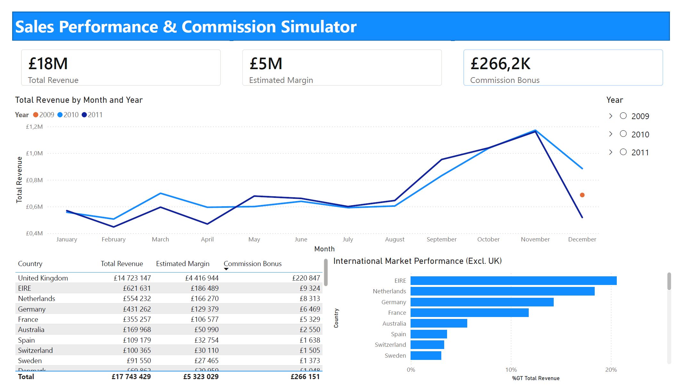

# Sales Performance & Commission Simulator

**Role:** Commercial Planning Analyst (Simulation)
**Tools:** SQL (ETL & Logic), Power BI (Visualization), DAX
**Goal:** Transform raw retail transaction data into an interactive dashboard to monitor sales performance and simulate a new commission structure.

## Project Overview
A UK-based online retailer needed to move from static Excel reporting to dynamic monitoring. The management also proposed a new bonus scheme (**5% commission on a fixed 30% margin**) and required a financial impact analysis before implementation.

**The Business Questions:**
1.  **Performance:** How is the company performing year-over-year?
2.  **Growth:** Which international markets are driving growth?
3.  **Simulation:** Is the proposed 5% commission scheme financially sustainable?

## Tech Stack
* **Data Cleaning & ETL:** SQL (Handling nulls, cancellations, type casting)
* **Data Visualization:** Power BI
* **Logic & Calculations:** DAX Measures

## Solution Architecture
I implemented a full-stack data workflow:

**1. Data Cleaning (SQL)**
* Processed ~1 million rows of transaction data (2009-2011).
* Removed cancellations (Invoice 'C'), negative quantities, and "anonymous" transactions.
* Standardized schema using Staging vs. Production table strategy.

**2. Business Logic (DAX)**
Instead of static Excel formulas, I used dynamic DAX measures:
* `Estimated Margin` = `[Total Revenue] * 0.30` (Assumption based on brief)
* `Commission Bonus` = `[Estimated Margin] * 0.05`

**3. Visualization (Power BI)**
* Designed a P&L-style layout (Revenue -> Margin -> Bonus).
* Created specific drill-downs for **International Markets** (Excl. UK) to reveal export trends.

## Key Findings
1.  **Seasonality:** Sales peak significantly in **Q4 (Sept-Dec)**, suggesting the need for increased inventory and staffing.
2.  **International Growth:** While the UK is dominant, **EIRE (Ireland)** and **Netherlands** are the top export performers.
3.  **Financial Impact:** The proposed 5% commission scheme would cost approx. **£266k** (~1.5% of total revenue), confirming it is financially sustainable.

## Dashboard
An interactive dashboard was created to visualize these trends and the simulation.

## Repository Structure
* `sql_scripts/` - ETL scripts for cleaning and standardization.
* `pbi_reports/` - The Power BI (`.pbix`) file and PDF export.
* `images/` - Screenshots for documentation.
* `README.md` - Project documentation.
