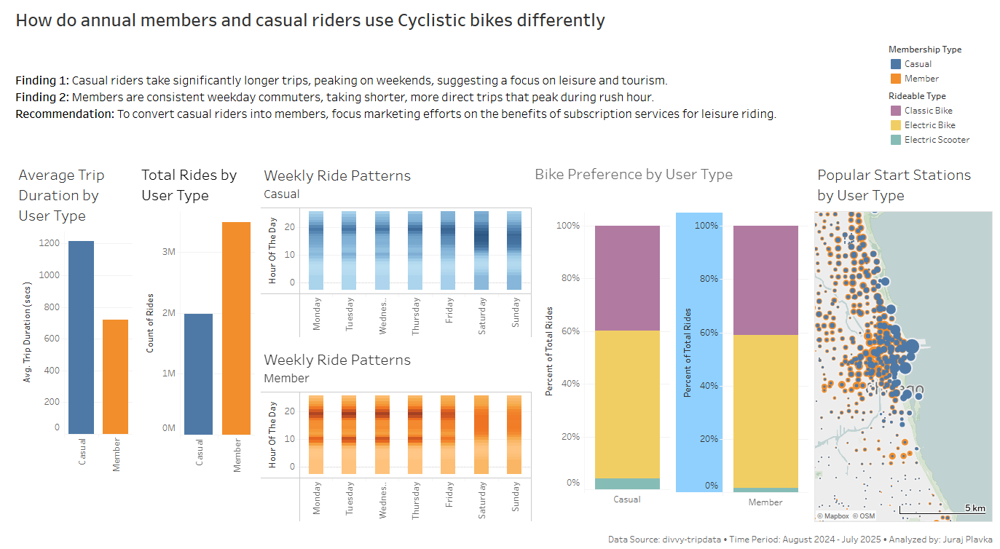

# Cyclistic Bike-Share Analysis

* **Role:** Data Analyst
* **Tools:** R (Data Cleaning & Analysis), Tableau (Visualization)
* **Goal:** Analyze usage patterns between Casual Riders and Annual Members to drive membership growth.

## Project Overview
**Cyclistic**, a bike-share company in Chicago, aims to maximize the number of annual memberships. The Director of Marketing believes the company’s future success depends on converting casual riders into members.

**The Business Question:**
*How do annual members and casual riders use Cyclistic bikes differently?*

## Tech Stack
* **Data Cleaning & Analysis:** R (Tidyverse, Lubridate, Arrow)
* **Data Visualization:** Tableau Public
* **Report:** RMarkdown

## Solution Architecture
I utilized R for high-volume data processing and Tableau for storytelling:

**1. Data Processing (R)**
* **Source:** [Divvy Trip Data](https://divvy-tripdata.s3.amazonaws.com/index.html) (12 months, ~5 million rows).
* **Merging:** Combined 12 monthly CSV files into a single dataframe.
* **Cleaning:** Removed trips <60s (false starts) and >24h (outliers).
* **Feature Engineering:** Created `trip_duration:`, `hour_of_the_day:`, and `day_of_week_name:`.

**2. Visualization (Tableau)**
* Created heatmaps to visualize "Commuter" vs. "Leisure" schedules.
* Mapped popular start stations to identify tourist hotspots.

## Key Findings
1.  **Ride Behavior:** Casual riders take significantly longer trips (leisure), while members take short, direct trips (commuting).
2.  **Weekly Trends:**
    * **Members:** Peak usage during weekdays at commute hours (8am, 5pm).
    * **Casuals:** Peak usage on weekends (Sat-Sun).
3.  **Bike Preference:** Casual riders show a stronger preference for electric bikes compared to members.

## Recommendations
1.  **"Weekend Warrior" Membership:** Create a weekend-only tier to target casual riders.
2.  **Duration Incentives:** Offer perks for longer rides (e.g., "First 45 mins free") to align with casual riding habits.
3.  **Leisure Campaigns:** Target ad spend on weekends near identified tourist stations.

## Dashboard
An interactive dashboard was created in Tableau to visualize these trends.

> **[Click here to view the interactive dashboard on Tableau Public](https://public.tableau.com/views/CyclisticBike-ShareAnAnalysisofMemberandCasualRiders_17562803507210/Dashboard-HowdoannualmembersandcasualridersuseCyclisticbikesdifferently?:language=en-US&:sid=&:redirect=auth&:display_count=n&:origin=viz_share_link)**

## Repository Structure
* `scripts/` - RMarkdown analysis file (`cyclistic_analysis.Rmd`) and HTML report.
* `output/` - Dashboard screenshots.
* `README.md` - Project documentation.

