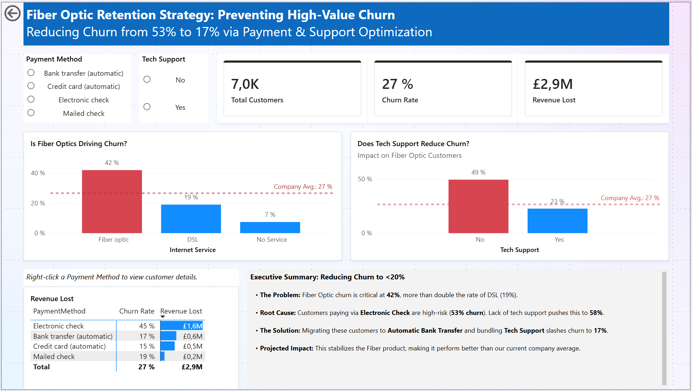

# Telco Churn Analysis

**Portfolio Project** *Diagnostic analysis of product failure and high-value customer churn.*

## Project Overview
**Telco**, a telecommunications provider, is experiencing high churn rates within its premium "Fiber Optic" internet service. The Product Director tasked me with diagnosing the root cause of this attrition and quantifying the revenue impact.

**The Goal:** Identify the specific customer segments causing the highest revenue loss and design a data-driven retention strategy.

**The Business Questions:**
1.  **Product Reliability:** Is the Fiber Optic service driving customers away compared to DSL?
2.  **Service Impact:** Does bundling "Tech Support" significantly reduce churn for premium users?
3.  **Revenue Risk:** Which payment methods are causing the highest financial loss from High-Value customers?

## Tech Stack
* **Data Cleaning & Logic:** SQL (MySQL)
* **Data Visualization:** Power BI (DAX, Drill-through, Slicers)
* **Reporting:** Executive Dashboard

## Data Source
**Source:** [Telco Customer Churn (IBM)](https://www.kaggle.com/datasets/blastchar/telco-customer-churn)
**Volume:** ~7,000 Customer Records
**Key Fields:** Tenure, Internet Service, Tech Support, Payment Method, Monthly Charges, Churn Status.

## Data Cleaning & Logic (SQL)
Raw data required cleaning and logic application in MySQL before being connected to Power BI.

1.  **Data Quality Check:** Identified and replaced null values in `TotalCharges` for new customers (Tenure = 0).
2.  **Feature Engineering:**
    * **`Tenure_Group`**: Segmented customers into cohorts (e.g., '< 1 Year', '1-2 Years') to analyze retention patterns across different lifecycle stages.
    * **`Churn_Count`**: Converted 'Yes'/'No' text to 1/0 integers to simplify aggregation in the BI tool.
    * **`High_Value_User`**: Created a flag for customers paying >$70/mo. *Note: EDA confirmed that ~92% of revenue loss came from this segment.*
3.  **View Creation:** Established a master view `vw_churn_data` to ensure consistent data definitions across all reports.

*(See `sql_scripts/telco_customers.sql` for the detailed code)*

## Key Findings
* **Finding 1 (The Product):** Fiber Optic customers churn at **41.9%**, significantly higher than DSL users (19%).
* **Finding 2 (The Solution):** Fiber customers *without* Tech Support churn at **49.4%**, whereas those *with* Tech Support churn at only **22.6%**.
* **Finding 3 (The Loss):** Customers paying via "Electronic Check" account for **£1.6M** in lost revenue (the highest of any segment).

## Dashboard
The final dashboard identifies a **"Death Spiral"** segment and proposes a "Golden Path" to retention.

## 💡 Recommendations
By combining Service, Payment, and Support variables, I identified a strategy to reduce churn from **53%** to **17%**.

1.  **Fix the "Toxic" Combination:** Fiber users paying via **Electronic Check** have a critical churn rate of **53%**. (If they also lack Tech Support, this spikes to **58%**).
2.  **The "Golden Path" Solution:** Migrating these users to **Automatic Bank Transfer** (reduces friction) AND bundling **Tech Support** (increases value) drops their churn to **17%**.
3.  **Strategic Impact:** This strategy transforms Fiber from the "riskiest" product to a stable revenue stream, performing better than the current DSL average.
4.  **Sales Action:** Implemented a **Drill-Through** feature allowing the Retention Team to export a list of "At-Risk" Electronic Check users for immediate outreach.

---
*Author: Juraj Plavka* *Date: December 17, 2025*